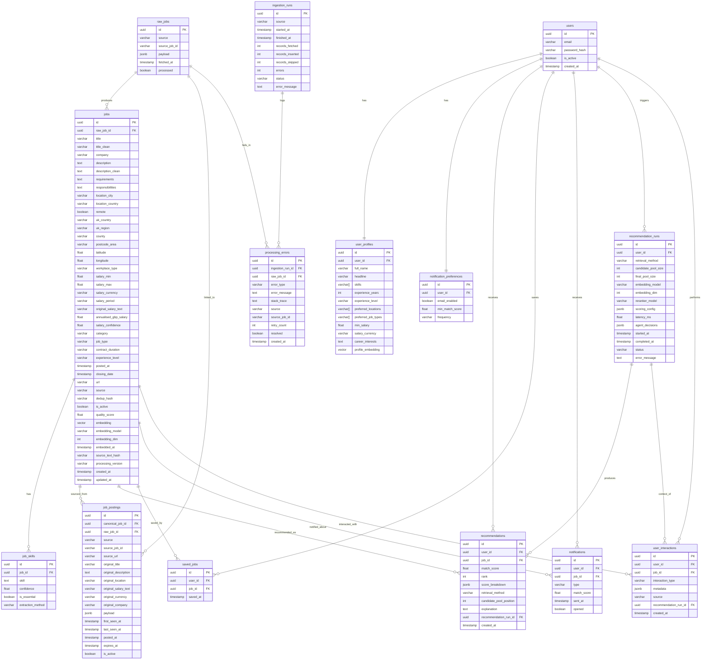

# Database Design — JobMatch AI

**Version:** 1.0
**Date:** 2026-07-13
**Database:** PostgreSQL 16 + pgvector

---

## 1. ER Diagram



---

## 2. Table Descriptions

### 2.1 Core Entities

#### `raw_jobs`
Raw, unprocessed data from each source. Preserved for re-processing without re-fetching.

| Column | Type | Notes |
|--------|------|-------|
| id | UUID | Primary key |
| source | VARCHAR(50) | csv/csv2/adzuna/reed/wwr |
| source_job_id | VARCHAR(255) | ID from source platform |
| payload | JSONB | Entire raw record |
| fetched_at | TIMESTAMP | When fetched |
| processed | BOOLEAN | Whether processed into jobs |

**Constraints:** UNIQUE(source, source_job_id)

---

#### `jobs`
Canonical job vacancy — the deduplicated, normalised representation after processing.

| Column | Type | Purpose |
|--------|------|---------|
| id | UUID | Primary key |
| raw_job_id | UUID | FK → raw_jobs (legacy, being replaced by job_postings) |
| title | VARCHAR(500) | Original title |
| title_clean | VARCHAR(500) | Cleaned title |
| company | VARCHAR(255) | Company name |
| description | TEXT | Original description |
| description_clean | TEXT | Description with boilerplate removed |
| requirements | TEXT | Extracted requirements |
| responsibilities | TEXT | Extracted responsibilities |
| location_city | VARCHAR(255) | Normalised city |
| location_country | VARCHAR(100) | Normalised country |
| remote | BOOLEAN | Whether role is remote |
| uk_country | VARCHAR(50) | England/Scotland/Wales/NI |
| uk_region | VARCHAR(100) | UK region |
| county | VARCHAR(100) | UK county |
| postcode_area | VARCHAR(10) | Postcode prefix |
| latitude | FLOAT | Geocoded latitude |
| longitude | FLOAT | Geocoded longitude |
| workplace_type | VARCHAR(50) | remote/hybrid/onsite |
| salary_min | FLOAT | Minimum salary |
| salary_max | FLOAT | Maximum salary |
| salary_currency | VARCHAR(10) | Currency code |
| salary_period | VARCHAR(20) | annual/monthly/hourly/daily |
| original_salary_text | VARCHAR(255) | Raw salary text from source |
| annualised_gbp_salary | FLOAT | Normalised to GBP annual |
| salary_confidence | FLOAT | Extraction confidence (0-1) |
| category | VARCHAR(100) | Canonical category |
| job_type | VARCHAR(50) | full-time/part-time/contract |
| contract_duration | VARCHAR(50) | permanent/fixed-term |
| experience_level | VARCHAR(50) | junior/mid/senior/lead |
| posted_at | TIMESTAMP | When posted |
| closing_date | TIMESTAMP | Application deadline |
| url | VARCHAR(1000) | Job URL |
| source | VARCHAR(50) | Primary source |
| dedup_hash | VARCHAR(64) | Deduplication hash |
| is_active | BOOLEAN | Whether listing is active |
| quality_score | FLOAT | Data quality score (0-1) |
| embedding | VECTOR(768) | Semantic embedding |
| embedding_model | VARCHAR(100) | Model used |
| embedding_dim | INT | Embedding dimensions |
| embedded_at | TIMESTAMP | When embedded |
| source_text_hash | VARCHAR(64) | Hash of embedding input text |
| processing_version | VARCHAR(50) | Pipeline version |
| created_at | TIMESTAMP | Record creation |
| updated_at | TIMESTAMP | Last update |

**Constraints:** UNIQUE(dedup_hash)

**Indexes:** category, is_active, source, created_at

---

#### `job_postings`
Source-specific posting data. One canonical job may have multiple postings from different platforms.

| Column | Type | Purpose |
|--------|------|---------|
| id | UUID | Primary key |
| canonical_job_id | UUID | FK → jobs |
| raw_job_id | UUID | FK → raw_jobs |
| source | VARCHAR(50) | Platform name |
| source_job_id | VARCHAR(255) | ID on source platform |
| source_url | VARCHAR(1000) | URL to original posting |
| original_title | VARCHAR(500) | Unprocessed title |
| original_description | TEXT | Unprocessed description |
| original_location | VARCHAR(500) | Unprocessed location |
| original_salary_text | VARCHAR(255) | Raw salary string |
| original_currency | VARCHAR(10) | Original currency |
| original_company | VARCHAR(255) | Original company name |
| payload | JSONB | Full raw payload |
| first_seen_at | TIMESTAMP | First ingestion |
| last_seen_at | TIMESTAMP | Most recent ingestion |
| posted_at | TIMESTAMP | Source posting date |
| expires_at | TIMESTAMP | Expiry date |
| is_active | BOOLEAN | Still active on source |

**Constraints:** UNIQUE(source, source_job_id)

**Indexes:** (canonical_job_id, is_active)

---

#### `job_skills`
Individual skills extracted from job postings.

| Column | Type | Purpose |
|--------|------|---------|
| id | UUID | Primary key |
| job_id | UUID | FK → jobs |
| skill | TEXT | Skill name (lowercase) |
| confidence | FLOAT | Extraction confidence |
| is_essential | BOOLEAN | Essential vs desirable |
| extraction_method | VARCHAR(50) | dictionary/llm/hybrid |

**Constraints:** UNIQUE(job_id, skill)

---

### 2.2 User Entities

#### `users`
User accounts.

| Column | Type | Purpose |
|--------|------|---------|
| id | UUID | Primary key |
| email | VARCHAR(255) | Login email |
| password_hash | VARCHAR(255) | bcrypt hash |
| is_active | BOOLEAN | Account active |
| created_at | TIMESTAMP | Registration date |

---

#### `user_profiles`
User preferences and profile data.

| Column | Type | Purpose |
|--------|------|---------|
| id | UUID | Primary key |
| user_id | UUID | FK → users (unique) |
| full_name | VARCHAR(255) | Display name |
| headline | VARCHAR(500) | Professional headline |
| skills | ARRAY(STRING) | User's skills |
| experience_years | INT | Years of experience |
| experience_level | VARCHAR(50) | junior/mid/senior/lead |
| preferred_locations | ARRAY(STRING) | Location preferences |
| preferred_job_types | ARRAY(STRING) | Job type preferences |
| min_salary | FLOAT | Minimum salary expectation |
| salary_currency | VARCHAR(10) | Salary currency |
| career_interests | TEXT | Career focus areas |
| profile_embedding | VECTOR(768) | Profile as vector |

---

#### `notification_preferences`
Per-user notification settings.

| Column | Type | Purpose |
|--------|------|---------|
| id | UUID | Primary key |
| user_id | UUID | FK → users (unique) |
| email_enabled | BOOLEAN | Notifications on/off |
| min_match_score | FLOAT | Threshold for notification |
| frequency | VARCHAR(20) | instant/daily/weekly |

---

### 2.3 Recommendation Entities

#### `recommendation_runs`
Audit trail for recommendation generation. Every agent invocation creates one record.

| Column | Type | Purpose |
|--------|------|---------|
| id | UUID | Primary key |
| user_id | UUID | FK → users |
| retrieval_method | VARCHAR(50) | semantic/hybrid/lexical |
| candidate_pool_size | INT | Candidates retrieved |
| final_pool_size | INT | Candidates after filtering |
| embedding_model | VARCHAR(100) | Model used |
| embedding_dim | INT | Embedding dimensions |
| reranker_model | VARCHAR(100) | Reranker used |
| scoring_config | JSONB | Weights/thresholds snapshot |
| latency_ms | FLOAT | Total latency |
| agent_decisions | JSONB | Decision log |
| started_at | TIMESTAMP | Run start |
| completed_at | TIMESTAMP | Run end |
| status | VARCHAR(20) | running/completed/failed |
| error_message | TEXT | Error if failed |

---

#### `recommendations`
Individual job recommendations within a run.

| Column | Type | Purpose |
|--------|------|---------|
| id | UUID | Primary key |
| user_id | UUID | FK → users |
| job_id | UUID | FK → jobs |
| match_score | FLOAT | Final score (0-1) |
| rank | INT | Position in ranked list |
| score_breakdown | JSONB | Per-factor scores |
| retrieval_method | VARCHAR(50) | How retrieved |
| candidate_pool_position | INT | Position before ranking |
| explanation | TEXT | RAG-generated text |
| recommendation_run_id | UUID | FK → recommendation_runs |
| created_at | TIMESTAMP | When created |

---

#### `saved_jobs`
User-bookmarked jobs.

| Column | Type | Purpose |
|--------|------|---------|
| id | UUID | Primary key |
| user_id | UUID | FK → users |
| job_id | UUID | FK → jobs |
| saved_at | TIMESTAMP | When saved |

---

#### `notifications`
Notification log.

| Column | Type | Purpose |
|--------|------|---------|
| id | UUID | Primary key |
| user_id | UUID | FK → users |
| job_id | UUID | FK → jobs |
| type | VARCHAR(30) | new_job/high_match/saved_job_update/recommendation_update |
| match_score | FLOAT | Match score at notification time |
| sent_at | TIMESTAMP | When sent |
| opened | BOOLEAN | Whether opened |

---

### 2.4 Monitoring Entities

#### `ingestion_runs`
Import run monitoring.

| Column | Type | Purpose |
|--------|------|---------|
| id | UUID | Primary key |
| source | VARCHAR(50) | Data source |
| started_at | TIMESTAMP | Run start |
| finished_at | TIMESTAMP | Run end |
| records_fetched | INT | Records fetched |
| records_inserted | INT | New records |
| records_skipped | INT | Duplicates skipped |
| errors | INT | Error count |
| status | VARCHAR(20) | running/completed/failed |
| error_message | TEXT | Error details |

---

#### `processing_errors`
Processing failure log.

| Column | Type | Purpose |
|--------|------|---------|
| id | UUID | Primary key |
| ingestion_run_id | UUID | FK → ingestion_runs |
| raw_job_id | UUID | FK → raw_jobs |
| error_type | VARCHAR(100) | Error classification |
| error_message | TEXT | Error description |
| stack_trace | TEXT | Full stack trace |
| source | VARCHAR(50) | Source name |
| source_job_id | VARCHAR(255) | Source job ID |
| retry_count | INT | Retry attempts |
| resolved | BOOLEAN | Whether resolved |
| created_at | TIMESTAMP | When logged |

---

### 2.5 Interaction Entities

#### `user_interactions`
User action tracking for implicit feedback.

| Column | Type | Purpose |
|--------|------|---------|
| id | UUID | Primary key |
| user_id | UUID | FK → users |
| job_id | UUID | FK → jobs |
| interaction_type | VARCHAR(50) | Event type |
| metadata | JSONB | Additional context |
| source | VARCHAR(50) | Where triggered |
| recommendation_run_id | UUID | FK → recommendation_runs |
| created_at | TIMESTAMP | When occurred |

**Interaction Types:**
- `impression` — Job shown to user
- `view` — User opened job detail
- `save` — User bookmarked job
- `unsave` — User removed bookmark
- `dismiss` — User dismissed job
- `apply_clicked` — User clicked apply link
- `marked_relevant` — User rated as relevant
- `marked_irrelevant` — User rated as irrelevant
- `notification_opened` — User opened notification

---

## 3. Migration Instructions

### 3.1 Setup Alembic (one-time)
```bash
cd jobmatch
pip install alembic
alembic init alembic
```

### 3.2 Apply Migrations
```bash
# Apply all migrations
alembic upgrade head

# Or via Python
python -c "from app.database import run_migrations; run_migrations()"
```

### 3.3 Create New Migration
```bash
alembic revision --autogenerate -m "description of change"
alembic upgrade head
```

### 3.4 Rollback
```bash
# Rollback one migration
alembic downgrade -1

# Rollback to specific version
alembic downgrade <revision_id>

# Rollback all
alembic downgrade base
```

---

## 4. Data Transformation Strategy

### 4.1 Existing Data Migration
The initial migration preserves all existing table structures. The new columns are added as nullable with no defaults, so existing data is untouched.

### 4.2 Backfill Strategy
For existing jobs that lack the new fields:
- `description_clean`, `requirements`, `responsibilities`: Run processing pipeline
- `uk_country`, `uk_region`: Geocode from location_city/location_country
- `quality_score`: Calculate from completeness metrics
- `embedding_model`, `embedding_dim`, `embedded_at`: Set from current model config
- `job_postings`: Create from existing raw_job_id relationships

### 4.3 Rollback Risks
- **Low risk:** New nullable columns can be dropped without data loss
- **Medium risk:** New tables can be dropped without affecting existing data
- **High risk:** The `job_postings` table is new; existing `raw_job_id` on `jobs` is preserved for backward compatibility
